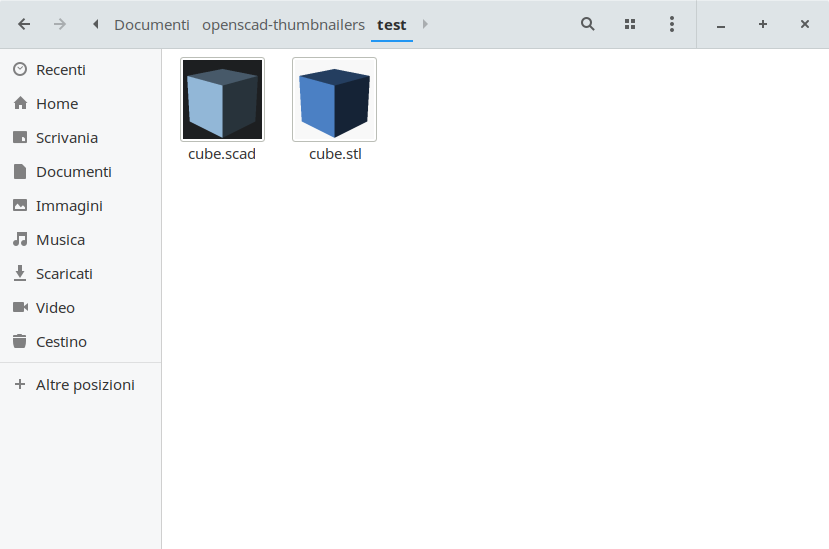

# Openscad thumbnailers




## Requires:

This project allows Nautilus (but also Nemo, Caja and PCManFM) to show thumbnails for `.stl` and `.scad` files.

**Openscad, imagemagick and sudo are required**


## Install

To install, open a terminal into this directory and execute `./install.sh`.


and restart Nautilus or Thunar and then your .slvs will show up rendered in the preview.
At least on debian you have to restart tumblerd too to reread the thumbnailer configuration.

```
% pkill tumblerd
% thunar -q & thunar
```


## Test

```
% stl2png <absolute-path>/test/cube.slvs out.png 64
```
