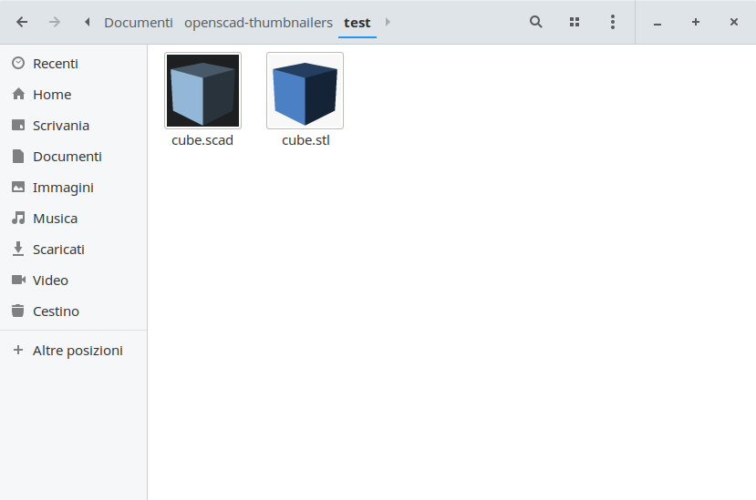

# Openscad thumbnailers




This project allows Thunar/Nautilus (but also Nemo, Caja and PCManFM) to show thumbnails for `.stl`, `.3mf` and `.scad` files.

For a thumbniler for solvespace `.slvs` files have a look at https://github.com/EtherGraf/solvespace-thumbnailer

## Requires:

* Openscad,
* imagemagick

```bash
% apt install openscad imagemagick
```


## Install

To install, open a terminal into this directory and execute `./install.sh`.


and restart Nautilus or Thunar and then your .scad will show up rendered in the preview.
At least on debian you have to restart tumblerd too to reread the thumbnailer configuration.

```bash
% pkill tumblerd
% thunar -q & thunar
```


## Test

```bash
% stl2png <absolute-path>/test/cube.slvs out.png 64
```

### Clear thumbnail cache

If you need to clear the thumbnail cache.
```bash
% rm -rf ~/.cache/thumbnails/*
```
